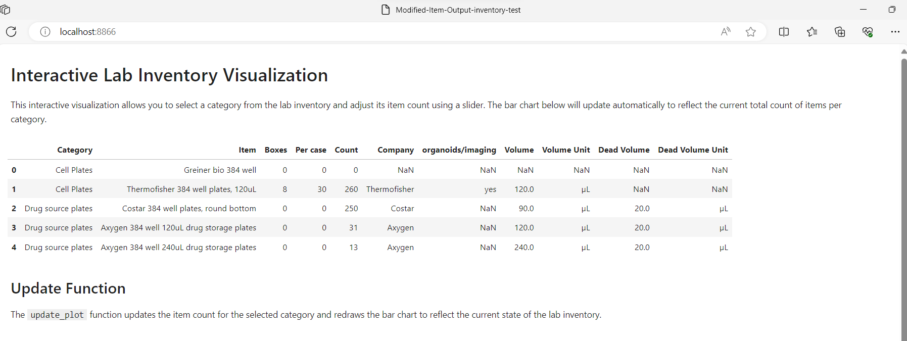
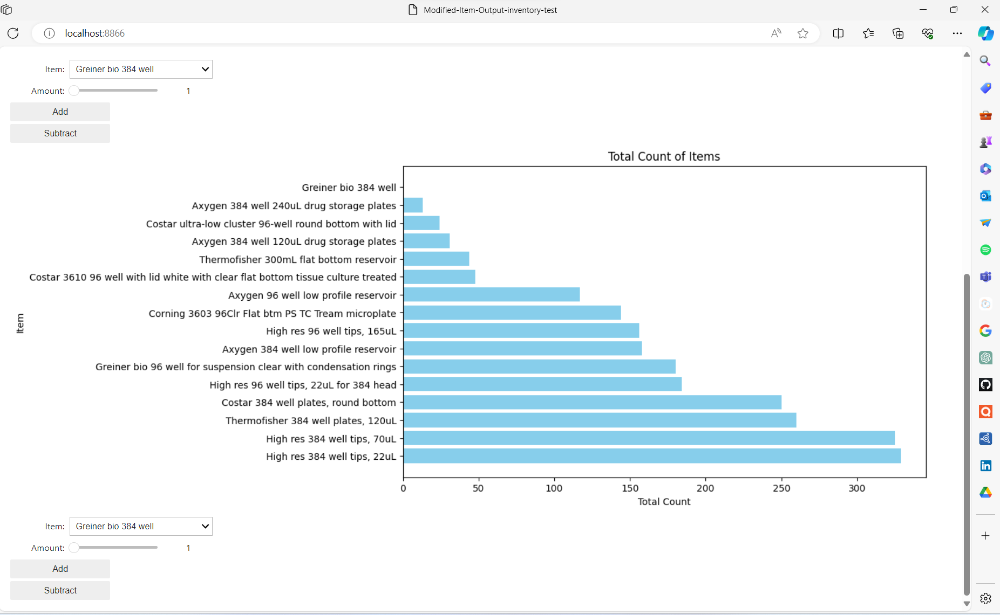

# HTDS-InventoryTracker

## Overview
HTDS-InventoryTracker is a specialized tool designed for high-throughput drug screening labs to efficiently manage and track their inventory. Developed using a Jupyter Notebook, this tool facilitates seamless interaction with Excel files, enabling users to perform real-time updates and management of inventory data. It stands out by offering a user-friendly interface and leveraging the powerful data processing capabilities of Python, making inventory management more accessible and less time-consuming.

*The interactive inventory management interface within Jupyter Notebook.*

## Table of Contents
- [Overview](#overview)
- [Features](#features)
- [Getting Started](#getting-started)
  - [Prerequisites](#prerequisites)
  - [Installation](#installation)
  - [Usage](#usage)
- [Contributing](#contributing)
- [License](#license)
- [Acknowledgments](#acknowledgments)
- [FAQs](#faqs)
- [Contact](#contact)

## Features
- **Interactive Interface**: Utilize the Jupyter Notebook for an interactive experience that simplifies inventory management tasks.
- **Excel Integration**: Directly read from and write to Excel files, ensuring a smooth workflow for updating inventory records.
- **Real-Time Updates**: Make immediate changes to your inventory records and view updates in real time, enhancing data accuracy and reliability.
- **Customizable**: Tailor the notebook to fit the specific needs of your lab, allowing for a personalized inventory management experience.

## Getting Started

## Try It Live

To try the HTDS-InventoryTracker in a live environment without installing anything, click on the following Binder link:

This will open the notebook in a temporary environment where you can test its functionality.

### Prerequisites
- Python 3.6 or higher
- Jupyter Notebook or JupyterLab

### Installation

1. Clone the repository:
git clone https://github.com/oalawa/HTDS-InventoryTracker.git

2. Navigate to the project directory:
cd HTDS-InventoryTracker

3. Install the required Python packages:
pip install -r requirements.txt

4. Launch Jupyter Notebook or JupyterLab:
jupyter notebook
or
jupyter lab

5. Open the `Modified-Item-Output-inventory-test.ipynb` notebook within the Jupyter interface.

### Usage
The notebook is designed with user-friendliness in mind. Here's how to get started:
- **Reading Inventory Data**: The notebook initially reads the existing inventory data from an Excel file.
- **Updating Records**: Follow the prompts and instructions within the notebook to add, remove, or modify inventory items.
- **Saving Changes**: Ensure you save your changes within the notebook to reflect updates in the Excel file.

For detailed step-by-step instructions, refer to the comments and documentation within the notebook itself.

## Contributing
We welcome contributions to the HTDS-InventoryTracker project! Whether it's feature enhancements, bug fixes, or documentation improvements, your help is invaluable. Please follow these steps to contribute:
1. Fork the repository.
2. Create a new branch for your feature or fix.
3. Commit your changes with clear, descriptive messages.
4. Push your changes and submit a pull request.

For more detailed instructions, please see [CONTRIBUTING.md](CONTRIBUTING.md).

## Contact
If you have any questions, feedback, or would like to get involved with the HTDS-InventoryTracker project, please open an issue in the GitHub repository or reach out directly via [GitHub Issues](https://github.com/oalawa/HTDS-InventoryTracker/issues).
or contact us directly at [oma4008@med.cornell.edu].

## FAQs
Q: How do I resolve dependency issues?
A: Ensure all dependencies are correctly installed by running `pip install -r requirements.txt`. If issues persist, consider creating a virtual environment for the project.

Q: Can I use this tool with Google Sheets?
A: Currently, the tool is optimized for Excel files. Integration with Google Sheets is a potential feature for future updates.

## License
This project is licensed under the MIT License - see the [LICENSE](LICENSE) file for details.

We're excited to see how you use and improve HTDS-InventoryTracker!
